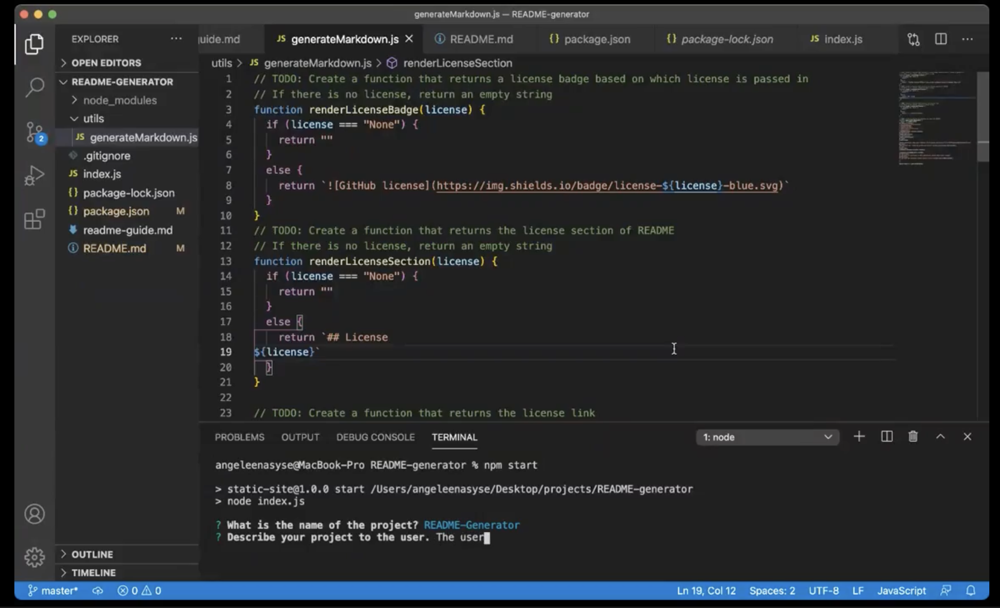
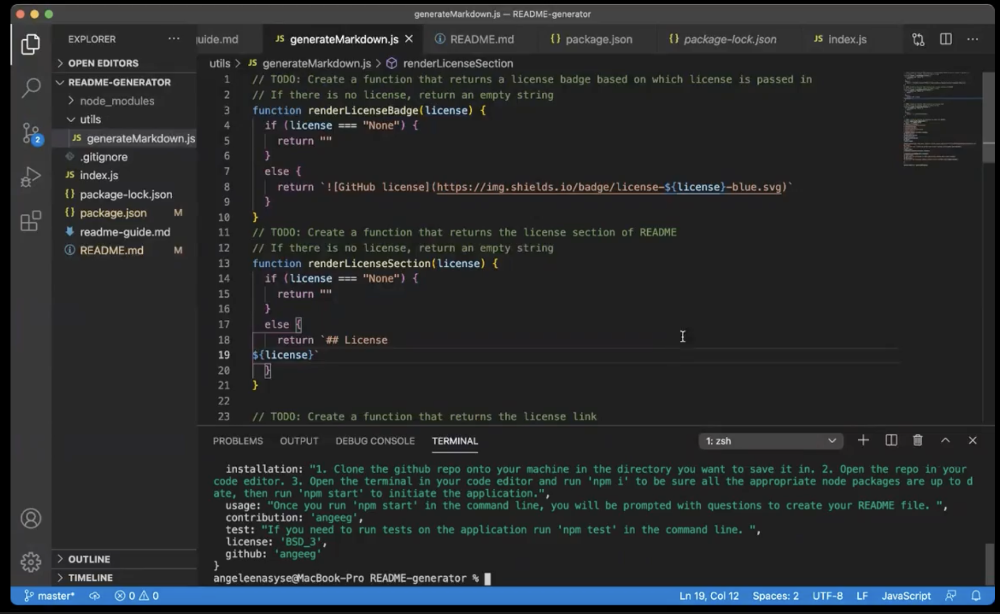
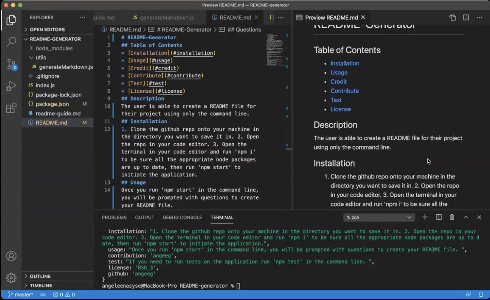

# README-Generator
## Table of Contents
* [Description](#description)
* [Installation](#installation)
* [Usage](#usage)
* [Credit](#credit)
* [Contribute](#contribute)
* [Test](#test)
* [License](#license)
## Description 
The user is able to create a README file for their project using only the command line. 
## Installation 
1. Clone the <a href="https://github.com/angeeg/readme-generator.git">github repo</a> onto your machine in the directory you want to save it in. 
2. Open the repo in your code editor. 
3. Open the terminal in your code editor and run 'npm i' then run 'npm start' to invoke the application.
## Usage 
Once you run 'npm start' in the command line, you will be prompted with questions to create your README file. 

[Walk-through video 1.](https://drive.google.com/file/d/13-BrYNio6B6UVHdaRzm-9FXNhZ-otjB2/view)

[Walk-through video 2](https://drive.google.com/file/d/1tD_5ciR9NpUYWehrD53wZYiFwQeevxGt/view)

### Technologies Used:
* Node.js 
* Javascript

## Credit
This project was created by <a href="https://github.com/angeeg">angeeg</a>.
## Test 
1. Run 'npm i jest' in the terminal to make sure the npm jest package is installed. 
2. In the 'package-json' under the "Scripts" section replace ' "test": "echo \"Error: no test specified\" && exit 1" ' with ' "test": "jest" '.
3. You must then create a folder in the root directory titled `__tests__` and create a files within that folder where you will input functionality you wish to test. 
4. To run a test, in the command line type 'npm test' and the jest package will run a test on the code in that folder. 

## License 
BSD_3

## Contribute 
If you wish to contribute to this application please send a pull request. 
## Questions
If you have any questions please contact <a href="https://github.com/angeeg">angeeg</a>.
